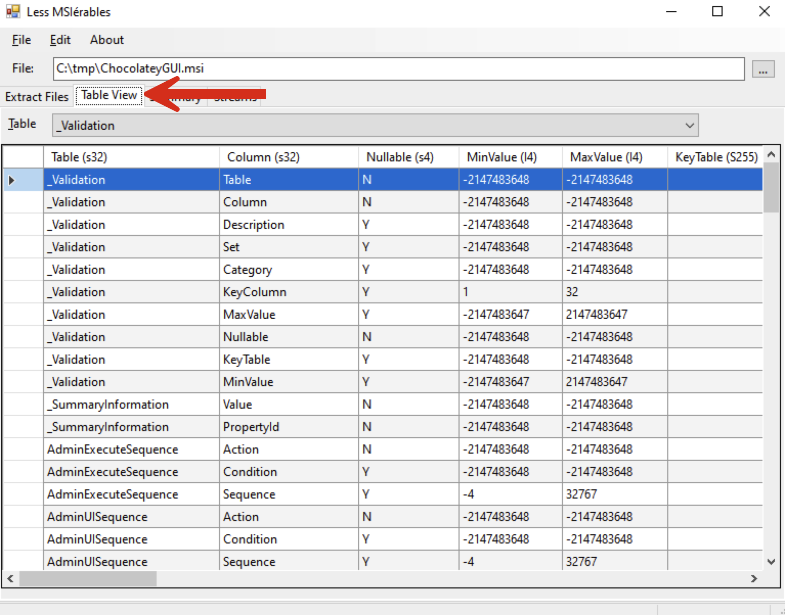
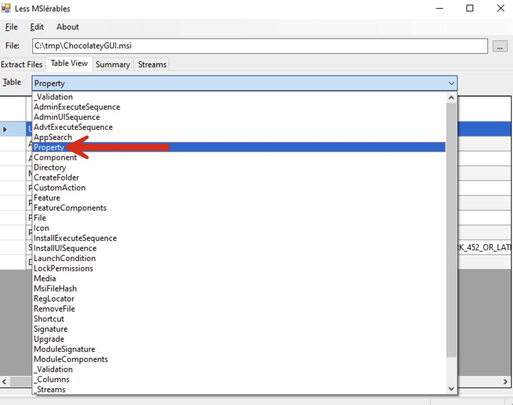
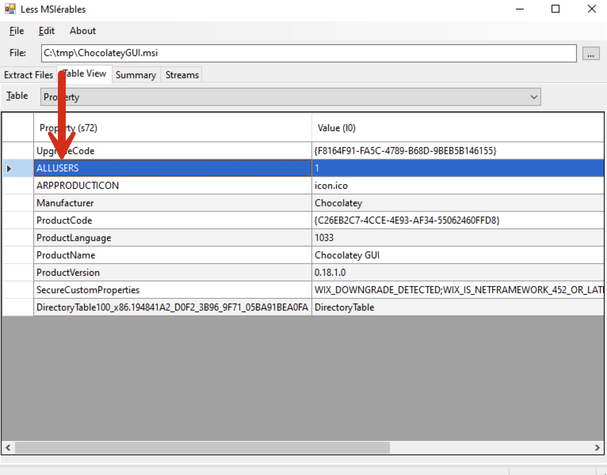

# Committers Guidelines

This file details what is needed for different operations in the repository that can not be handled by opening pull requests.

<!-- markdownlint-disable -->
<!-- START doctoc generated TOC please keep comment here to allow auto update -->
<!-- DON'T EDIT THIS SECTION, INSTEAD RE-RUN doctoc TO UPDATE -->
<details>
<summary>Table of Contents</summary>

- [Providing A Fixed Version](#providing-a-fixed-version)
  - [Updating a Manual Package](#updating-a-manual-package)
  - [Request A Standard Fix Version Creation](#request-a-standard-fix-version-creation)
  - [Request A Standard Fix Version Creation For A Stream](#request-a-standard-fix-version-creation-for-a-stream)
    - [Request A Fixed Version Update](#request-a-fixed-version-update)
    - [Requesting A Fix For A Package Using 4 Part Version Number](#requesting-a-fix-for-a-package-using-4-part-version-number)
- [Conventions](#conventions)
  - [Installer Arguments](#installer-arguments)
  - [Installer Technologies](#installer-technologies)
    - [MSI Installer](#msi-installer)
    - [Inno Setup Installer](#inno-setup-installer)
    - [NSIS Installer](#nsis-installer)
    - [InstallShield Installer](#installshield-installer)
    - [Wise InstallMaster Installer](#wise-installmaster-installer)
    - [Ghost Installer](#ghost-installer)
    - [Squirrel Installer](#squirrel-installer)
    - [Install4j Installer](#install4j-installer)

</details>
<!-- END doctoc generated TOC please keep comment here to allow auto update -->

<!-- markdownlint-enable -->

## Providing A Fixed Version

Before providing a fixed package version, you need to determine the existing version specified in the repository, what type of version it uses, and whether the package contains additional handling for creating fixed versions.

### Updating a Manual Package

A manual package is one that is not using the `Chocolatey-AU` automation. The specific package files should be updated normally (i.e. the `.nuspec` file and the Chocolatey package scripts). Once those are updated, and the pull request merged, the package is pushed to the Chocolatey Community Repository by making an empty commit, with the message in the format `[PUSH <PACKAGENAME>]` where `<PACKAGENAME>` is the name of the package you want to push.

### Request A Standard Fix Version Creation

A standard fix version creation is intended for packages that do not use streams and does not use a 4-part version number - usually determined by whether there is no JSON file available in the package directory and the package metadata file uses a 2 or 3-part version number.

To request a fixed version, create an empty commit with the message `[AU packageName]`. This can be done by using the following command line call: `git commit --allow-empty -m "[AU packageName]"` (replace packageName with the actual name of the package). Ensure you don't make any changes, as this can prevent your ability to push the commit.

### Request A Standard Fix Version Creation For A Stream

To request a standard fixed version for a stream, you need to figure out the name of the stream you want to force the fixed version of. All packages that support streams are expected to have a JSON file next to their metadata file that contains a list of the different streams and the last version found for that stream. Find the stream in this file, and make sure that the stream uses a 2 or 3-part version number.
Commonly, the highest version is located in the stream name `latest` (however, not always). It is also not guaranteed that all streams listed in the file are available.

To request a fixed version, in this case, you create an empty commit with the message `[AU packageName\streamName]`. This can be done by using the following command line call: `git commit --allow-empty -m "[AU packageName\streamName]` (replace packageName with the actual name of the package, and streamName with the name of the stream). Ensure you don't make any changes, as this can prevent your ability to push the commit.

#### Request A Fixed Version Update

If you need to update the same version the updater had previously submitted, or if the package you want uses a 4-part version number, you may need to specify the exact version you want to push.
It is crucial to note here that the version used will only change the version specified in the metadata file of the pushed package and not decide which version of the software will be pulled down from any upstream location.

To create a fixed version update, you may use `[AU packageName:packageVersion]` for standard packages and `[AU packageName\streamVersion:packageVersion]` for stream packages using the same git command mentioned previously. Ensure you don't make any changes, as this can prevent your ability to push the commit.

#### Requesting A Fix For A Package Using 4 Part Version Number

If you need to create a fixed version for a package that already uses four parts of the version number, you must first add or update the updater script.
Before setting the `Version` parameter to the returned object in `au_GetLatest`, add a call to the function `Get-FixVersion`. This call should also include the parameter `-OnlyFixBelowVersion` that it set to the next patch version of the package.
See [gom-player](https://github.com/chocolatey-community/chocolatey-packages/blob/1849e4d17c66ff11cd48f4b8c9bf861add15bb68/automatic/gom-player/update.ps1#L38) for an example of this. Do note that you may need to create these changes as part of a PR if you cannot bypass the required checks in the repository.

After committing this change, you can do a standard fix version creation.

## Conventions

### Installer Arguments

We want to strive towards all packages using consistent arguments when possible for the different installer technologies.
The arguments used by installers are typically different, but each technology should use the same arguments when it is possible to do so.

To determine installers and the possible support of arguments, there are three utilities available on the Chocolatey Community Repository that may be used, and it is expected that anyone working on this repository has these installed.

1. The easiest utility to use to determine an installer is the [Universal Silent Switch Finder][]. When it determines the installer, it also suggests the arguments to use to make the installation silent. Verify these arguments with the below information about what should be used in this repository.
2. A more advanced utility to use is the [TrID - File Identifier][]. This is a more up-to-date utility that can handle different file types, not just installers. Unfortunately, this does not handle most NSIS installer types and will not provide information about possible silent arguments.
3. The third utility to use is only available in some cases for MSI installers. The utility [LessMSI][] can be used on MSI installers to find out what properties are available in the installer. Typically, these properties can be used as part of silent arguments. Usually, we are only interested if the property `ALLUSERS` is available to be used here.

All arguments should follow the same structure, as defined below. In general, all arguments should be defined within single quotes. The exception is when we are using a variable, for instance, an environment variable (like the below MSI and Inno Setup sections), which should instead use double quotes.

See the next section about installer technologies for the arguments that should be used when creating a Chocolatey CLI package for the installer and possible cautions or problems.

### Installer Technologies

#### MSI Installer

The MSI installer is a standard developed by Microsoft to create a specific set of instructions that will be used to simplify installation for users and will always have the `.msi` file extension.

The implementation of such installers may vary in what they support, but the most known to us at this time is the [WiX Toolset][].
The popular build system called [CMake][] also makes use of the WiX Toolset to create MSI installers.

All MSI installers have a common set of arguments that need to be used to install silently and can be seen by calling the installer with the argument `/?`. The arguments that are expected to be used by such an installer are:

```cmd
/qn /norestart /l*v `"$($env:TEMP)\$($env:chocolateyPackageName).$($env:chocolateyPackageVersion).MsiInstall.log`"
```

The following exit codes should always be specified as valid: `0`, `1641`, `3010`.

When the installer supports a property called `ALLUSERS`, this property should always be specified as `ALLUSERS=1` at the end of the silent arguments.

The easiest way to figure out if this property is supported or not is to make use of the [LessMSI][] utility.
This can be done by first launching the utility and passing in the path to the executable.

```cmd
lessmsi-gui C:\path\to\installer.msi
```

Change the tab to `Table View`, change the Table dropdown to `Property` and see if the `ALLUSERS` property is defined.





We want this property to have the value of `1`, but to be safe, we will always specify this value manually when possible when installing the package. When the property is supported, the result of the silent arguments should be:

```cmd
/qn /norestart /l*v `"$($env:TEMP)\$($env:chocolateyPackageName).$($env:chocolateyPackageVersion).MsiInstall.log`" ALLUSERS=1
```

#### Inno Setup Installer

Inno Setup Installers are among the most popular technologies used to create installers and have been around since 1997. The latest version of this technology at the time of writing is v6.2.2, but both installers created using v5.x and other v6.x versions can be seen in the wild.

Both the utilities [Universal Silent Switch Finder][] and [TrID - File Identifier][] can detect such an installer in almost all cases.

This installer technology provides common argument documentation by passing in `/HELP` to the installer, and 6.x can also be viewed on their website by going [here](https://jrsoftware.org/ishelp/).

Both Version 5.x and 6.x use the same arguments to make an installer silent. The arguments that should be used in this case are:

```cmd
/VERYSILENT /SP- /SUPPRESSMSGBOXES /NORESTART /RESTARTEXITCODE=3010 /LOG=`"$(env:TEMP)\$($env:chocolateyPackageName).$($env:chocolateyPackageVersion)`"
```

Remember to also specify the exit codes `0` and `3010` as valid exit codes for the package.

There are times when a restart of an application is needed to finish the installation. This can be achieved by passing in the argument `/RESTARTAPPLICATIONS` as the silent argument. (**NOTE: Be careful using this method. It may cause issues for users with applications that do not automatically save their state**).

In versions 6.0.0 and above, an argument was added to attempt to force the installation into administrative mode. This needs to be supported by the developers to take any effect, and in most cases it is not needed.
However, if it is seen during normal admin installation that it is not installing for all users, update the silent arguments to also pass in the argument `/ALLUSERS`.

**WARNING: Do not use the argument `/TASKS`, instead the argument `/MERGETASKS` should be used. This allows us to decide some defaults that we want without preventing any new tasks defined by a developer from being executed.**

#### NSIS Installer

NSIS Installers (*Nullsoft Scriptable Install System Installers*) are the most flexible installers that you may come across that are commonly used.
Due to the flexibility this installer technology allows, the burden of what is supported is completely left up to the developers creating these types of installers.
The popular build system called [CMake][] also makes use of the NSIS to create non-MSI installers.

However, one of the common arguments to make this installer silent and work for most can be achieved with the following arguments:

```cmd
/S
```

Documentation can be seen here: https://nsis.sourceforge.io/Docs/Chapter3.html#installerusagecommon

**WARNING: Arguments for NSIS installers are case-sensitive.**

#### InstallShield Installer

Installers using InstallShield technology typically come in two different variants.
One variant that is a pure executable installer and one that uses an embedded MSI file for the installation.

**Currently, not much is known about this installer type, and any help expanding this documentation would be appreciated.**

For installers of this technology that do not contain an embedded MSI file, the arguments to use are:

```cmd
/s
```

If the installer makes use of an embedded MSI file, the arguments to use are:

```cmd
/s /v"/qn"
```

#### Wise InstallMaster Installer

**At this time, no information is available for this technology; any help in expanding this documentation would be appreciated.**

The arguments used when coming across this installer are:

```cmd
/s
```

#### Ghost Installer

**At this time, no information is available for this technology; any help in expanding this documentation would be appreciated.**

The arguments used when coming across this installer are:

```cmd
-s
```

#### Squirrel Installer

Installers using Squirrel technology are self-extracting NuGet packages that only install for the current user running the installer.
Due to this limitation, it is best to avoid this kind of installer in a Chocolatey CLI package and see if the developers of the software provide any alternative means of installation.
Documentation and information about this installer can be found [here](https://github.com/Squirrel/Squirrel.Windows).

The arguments used when coming across this installer are:

```cmd
-s
```

#### Install4j Installer

**At this time, no information is available for this technology; any help in expanding this documentation would be appreciated.**

The arguments used when coming across this installer are:

```cmd
-q
```

[CMake]: https://cmake.org/
[LessMSI]: https://community.chocolatey.org/packages/lessmsi
[TrID - File Identifier]: https://community.chocolatey.org/packages/trid
[Universal Silent Switch Finder]: https://community.chocolatey.org/packages/ussf
[WiX Toolset]: https://wixtoolset.org/
