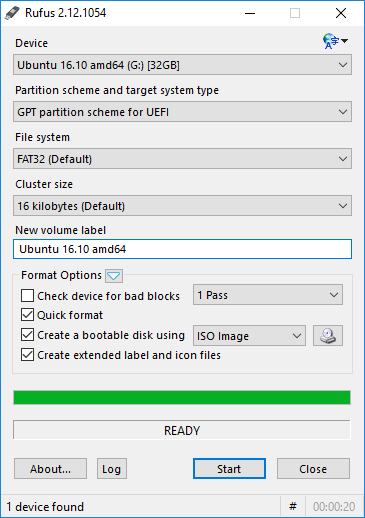

#  [rufus](https://chocolatey.org/packages/rufus)

Rufus is a utility that helps format and create bootable USB flash drives, such as USB keys/pendrives, memory sticks, etc.

It can be especially useful for cases where:

- you need to create USB installation media from bootable ISOs (Windows, Linux, UEFI, etc.)
- you need to work on a system that doesn't have an OS installed
- you need to flash a BIOS or other firmware from DOS
- you want to run a low-level utility

## Features

* Format USB, flash card and virtual drives to FAT/FAT32/NTFS/UDF/exFAT/ReFS
* Create DOS bootable USB drives, using [FreeDOS](http://www.freedos.org/) or MS-DOS
* Create BIOS or UEFI bootable drives, including [UEFI bootable NTFS](https://github.com/pbatard/uefi-ntfs)
* Create bootable drives from bootable ISOs (Windows, Linux, etc.)
* Create bootable drives from bootable disk images, including compressed ones
* Create [Windows To Go](https://en.wikipedia.org/wiki/Windows_To_Go) drives
* Twice as fast as Microsoft's USB/DVD tool or UNetbootin, on ISO -> USB creation.
* Perform bad blocks checks, including detection of "fake" flash drives
* Compute MD5, SHA-1 and SHA-256 checksums of the selected image
* Modern and familiar UI, with more than [35 languages natively supported](https://rufus.akeo.ie/translations)
* Small footprint. No installation required.
* Portable
* 100% [Free Software](http://www.gnu.org/philosophy/free-sw.en.html) ([GPL v3](http://www.gnu.org/licenses/gpl-3.0.en.html))

* [FAQ](https://github.com/pbatard/rufus/wiki/FAQ)
* [Supported ISOs](http://rufus.akeo.ie/#ref2)

